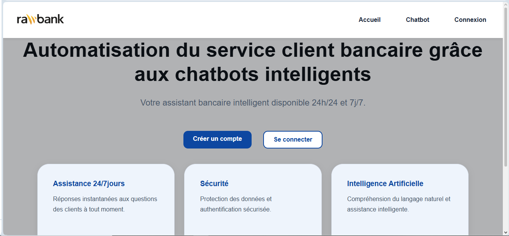
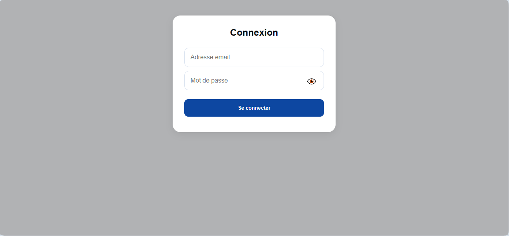
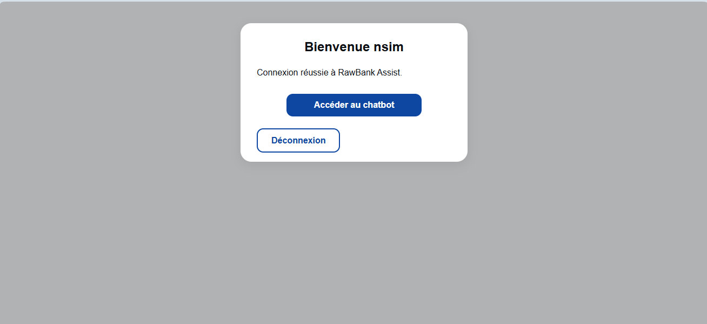
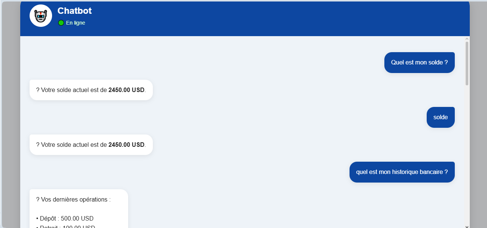

# 🏦 RawBank Assist

RawBank Assist est une application web développée dans le cadre d'un projet académique. Son objectif est d'améliorer le service client bancaire grâce à un chatbot conversationnel capable d'assister les utilisateurs.

## Technologies utilisées

- PHP
- MySQL
- HTML5
- CSS3
- JavaScript

## Fonctionnalités principales

- Authentification des utilisateurs
- Tableau de bord
- Chatbot conversationnel
- Interface responsive

## Aperçu de l'application

### Page d'accueil

### Connexion

La page de connexion permet aux utilisateurs d'accéder à leur espace personnel de manière sécurisée.

### Tableau de bord

### Chatbot

## Auteur

**Ir Didier Nsim**

Étudiant en ingénierie informatique – Haute École de Commerce de Kinshasa

---

© 2026 Ir Didier Nsim. Tous droits réservés.